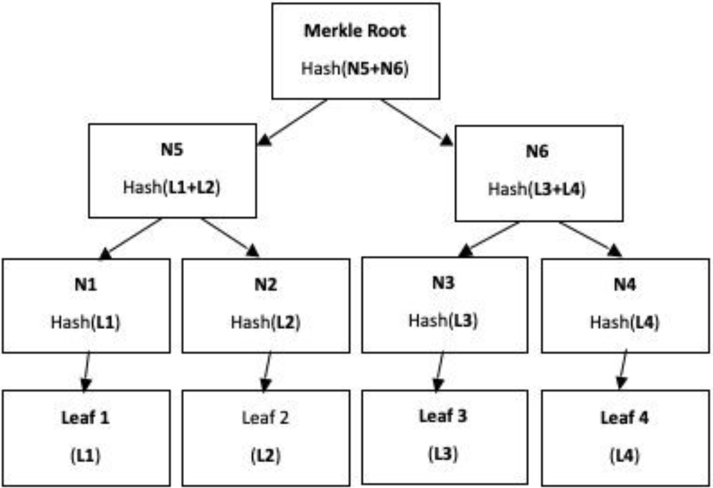
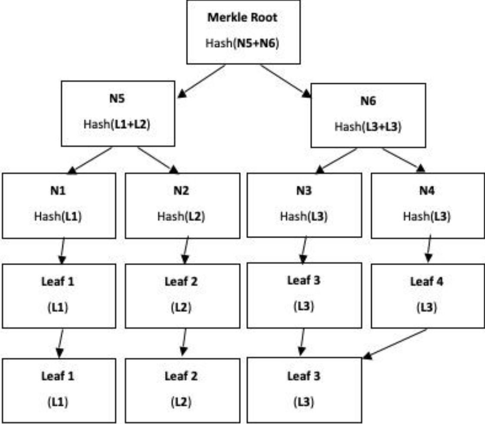
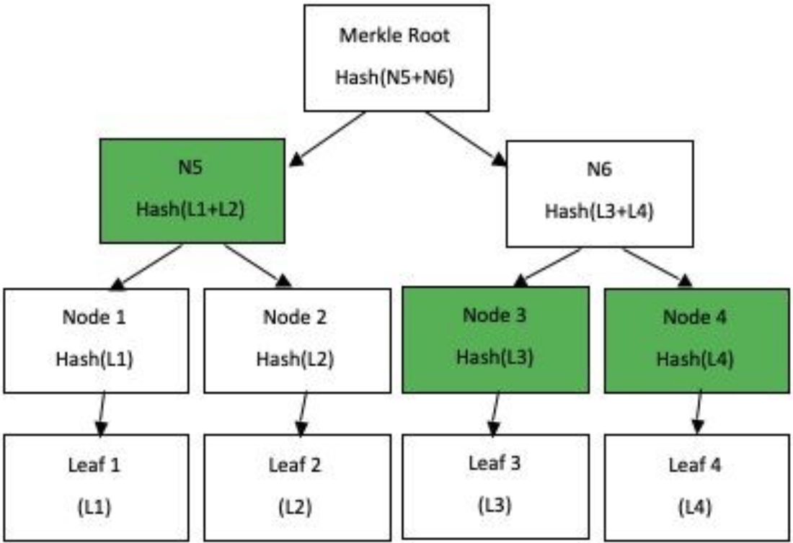

# Merkle Tree
The implementation of a Merkle Tree using Python. Provided with a merkletree.py (Python Class) and two test files, you can test the newly implemented functionality of the tree. Steps to implement the build_root method and the request_proof method are provided below.  

## Merkle Tree Specification

### 1.	Building a Merkle Tree
Even number of elements (Hash can be any cryptographically secure hash function)



### 2.	Odd number of elements



### 3.	Building a Merkle Proof 

a.	Verify that L3 was indeed inside the tree and took part in the construction of the Root Hash 
b.	The nodes that are colored in green are required for the proof 



## Request Proof Solution (build_root should be implemented)

We are going to use a modified version of the Depth-First-Search Algorithm

*	Write the pre-conditions of the algorithm 
    *	Hash the passed in value using self.digest delegate since the values in the leaves are not kept in plaintext 
    *	If the hash of the value that was passed in is not contained in the tree, raise an Exception. 
    *	Create the __build_valid_proof method that we will use to implement the algorithm for the proof 
    *	Pass the root, the hashed value and an empty list to the __build_valid_proof method 
    *	Add the value itself as a part of the proof 

## Testing the solution 
Now test the solutions with the provided python test files. 

* merkleproof-test
```bash
python3 merkleproof-test.py
```
The following output signalizes that all the tests passed.

```bash
test_merkle_should_contain_items (__main__.MerkleProofTest) ... ok
test_merkle_should_return_correct_proof_on_edge_case (__main__.MerkleProofTest) ... ok
test_merkle_should_return_correct_proof_when_leaf_is_left_child (__main__.MerkleProofTest) ... ok
test_merkle_should_return_correct_proof_when_leaf_is_right_child (__main__.MerkleProofTest) ... ok
test_merkle_should_throw_on_requesting_proof_for_non_existing_element (__main__.MerkleProofTest) ... expected failure
```
* merkletree-test
```bash
python3 merkletree-test.py
```
The following output signalizes that all the tests passed.
```bash
test_merkle_no_digest (__main__.MerkleTest) ... ok
test_merkle_with_cryptographic_digest (__main__.MerkleTest) ... ok
test_unable_to_build_from_empty_collection (__main__.MerkleTest) ... expected failure
```
### Module
MI1: Module 3: E1
